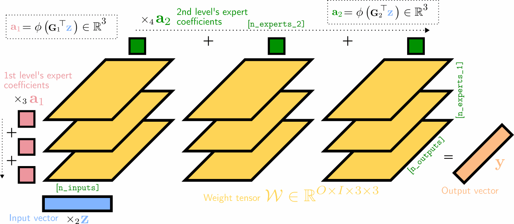

# Multilinear Mixture of Experts:<br> Scalable Expert Specialization through Factorization

[](https://arxiv.org/abs/2402.12550) [](http://eecs.qmul.ac.uk/~jo001/MMoE/)

## Abstract

> **Multilinear Mixture of Experts: Scalable Expert Specialization through Factorization**<br>
James Oldfield, Markos Georgopoulos, Grigorios G. Chrysos, Christos Tzelepis, Yannis Panagakis, Mihalis A. Nicolaou, Jiankang Deng, Ioannis Patras<br>
*ArXiv*, 2024 <br>
https://arxiv.org/abs/2402.12550 <br>
> **Abstract**: The Mixture of Experts (MoE) paradigm provides a powerful way to decompose inscrutable dense layers into smaller, modular computations often more amenable to human interpretation, debugging, and editability. A major problem however lies in the computational cost of scaling the number of experts to achieve sufficiently fine-grained specialization. In this paper, we propose the Multilinear Mixutre of Experts (MMoE) layer to address this, focusing on vision models. MMoE layers perform an implicit computation on prohibitively large weight tensors entirely in factorized form. Consequently, MMoEs both (1) avoid the issues incurred through the discrete expert routing in the popular 'sparse' MoE models, yet (2) do not incur the restrictively high inference-time costs of 'soft' MoE alternatives. We present both qualitative and quantitative evidence (through visualization and counterfactual interventions respectively) that scaling MMoE layers when fine-tuning foundation models for vision tasks leads to more specialized experts at the class-level whilst remaining competitive with the performance of parameter-matched linear layer counterparts. Finally, we show that learned expert specialism further facilitates manual correction of demographic bias in CelebA attribute classification.



> Illustration of a two-hierarchy MMoE layer’s (unfactorized) forward pass as a series of tensor contractions, with 3 experts at both levels of hierarchy. The experts’ weight matrices are visualized as 2D horizontal slices in yellow, which are (1) matrix-multiplied with the input vector, (2) summed over the first expert mode (weighted by the first expert coefficients a1 in red), and (3) summed over the second expert mode (weighted by the second expert mode’s coefficients a2 in dark green).


## Install

First, please install the necessary dependencies:

```bash
pip install -r requirements.txt
```

## Usage

### CPMMoE

```python
# initialise a rank-R CPMMoE
import torch
from MMoE import CPMMoE

n_experts = 32; batch_size = 4; in_dim = 4; out_dim = 8
x = torch.randn(batch_size, in_dim)

R = 32
model = CPMMoE(in_dim, out_dim, expert_dims=[n_experts], rank=R)
y = model(x)

# or with two levels of hierarchy
model = CPMMoE(in_dim, out_dim, expert_dims=[n_experts, 2], rank=R, hierarchy=2)
y = model(x)
```

### TuckerMMoE

```python
import torch
from MMoE import TuckerMMoE

n_experts = 32; batch_size = 4; in_dim = 4; out_dim = 8
x = torch.randn(batch_size, in_dim)

ranks = [8, 8, 8]
model = TuckerMMoE(in_dim, out_dim, expert_dims=[n_experts], ranks=ranks)
y = model(x)

# or with two levels of hierarchy
ranks = [8, 8, 8, 8]
model = TuckerMMoE(in_dim, out_dim, expert_dims=[n_experts, 2], ranks=ranks, hierarchy=2)
y = model(x)
```

### TT/TRMMoE

```python
import torch
from MMoE import TTMMoE

n_experts = 32; batch_size = 4; in_dim = 4; out_dim = 8
x = torch.randn(batch_size, in_dim)

r1 = 1 ; r2 = 4 ; r3 = 4  # TT
r1 = 4 ; r2 = 4 ; r3 = 4  # TR
ranks = [[r1, n_experts, r2], [r2, in_dim, r3], [r3, out_dim, r1]]
model = TTMMoE(in_dim, out_dim, expert_dims=[n_experts], ranks=ranks)
y = model(x)

# or with two levels of hierarchy
r1 = 1 ; r2 = 4 ; r3 = 4 ; r4 = 4  # TT
r1 = 4 ; r2 = 4 ; r3 = 4 ; r4 = 4  # TR
ranks = [[r1, n_experts, r2], [r2, n_experts, r3], [r3, in_dim, r4], [r4, out_dim, r1]]
model = TTMMoE(in_dim, out_dim, expert_dims=[n_experts, 2], ranks=ranks, hierarchy=2)
y = model(x)
```

## Experiments

Coming soon

## Citation

If you find our work useful, please consider citing our paper:

```bibtex
@misc{oldfield2024mmoe,
    title={Multilinear Mixture of Experts: Scalable Expert Specialization through Factorization},
    author={James Oldfield and Markos Georgopoulos and Grigorios G. Chrysos and Christos Tzelepis and Yannis Panagakis and Mihalis A. Nicolaou and Jiankang Deng and Ioannis Patras},
    year={2024},
    eprint={2402.12550},
    archivePrefix={arXiv},
    primaryClass={cs.CV}
}
```

## Contact

**Please feel free to get in touch at**: `j.a.oldfield@qmul.ac.uk`